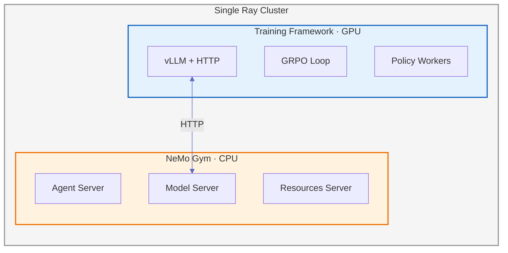
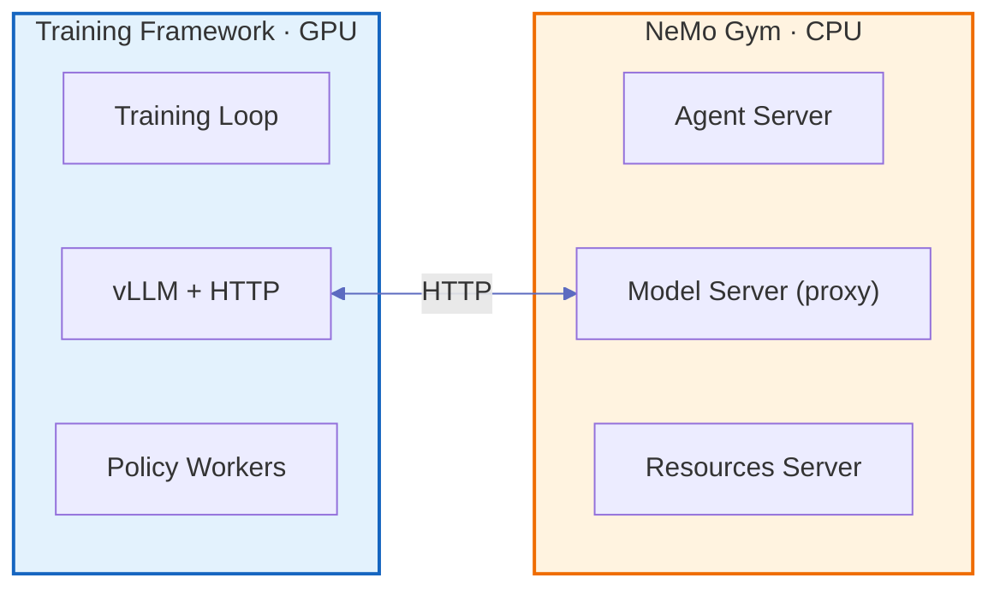
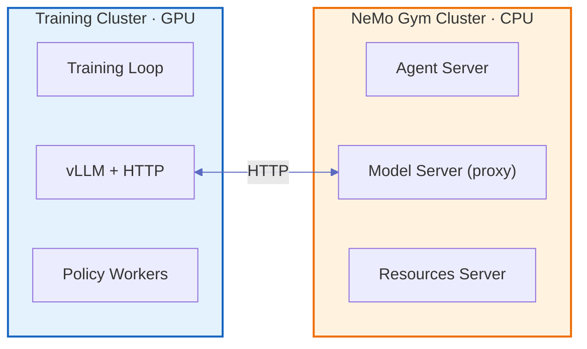

## Training Framework Deployment

When NeMo Gym is used for RL training (not standalone rollout collection), it runs alongside a training framework. NeMo Gym's Model Server acts as an HTTP proxy for policy model inference — it translates between the Responses API and Chat Completions API formats, forwarding requests to the training framework's generation endpoint (e.g., vLLM). NeMo Gym can also run other models on GPU (e.g., reward models, judge models) through its own resources servers.

This section covers resource requirements, cluster strategies, and how to choose between them. For a detailed integration walkthrough from the training framework side, see how [NeMo RL integrated with NeMo Gym](https://github.com/NVIDIA-NeMo/RL/blob/main/docs/design-docs/nemo-gym-integration.md). For guidance on integrating a new training framework, see [Index](/latest/contribute/rl-framework-integration).

### Resource Requirements

NeMo Gym and the training framework have different compute profiles:

| Component | Compute | Role |
|-----------|---------|------|
| **NeMo Gym** | CPU by default | Orchestrates rollouts, executes tools, computes rewards. Some resources servers may use GPUs (e.g., running local reward or judge models via vLLM). |
| **Training framework** (e.g., NeMo RL) | GPU | Holds model weights, runs policy training, serves inference via an OpenAI-compatible HTTP endpoint (e.g., vLLM) |

### Cluster Co-location Strategy

The deployment strategy depends on how the training framework manages its cluster.

#### Single Ray Cluster

If `ray_head_node_address` is specified in the config, NeMo Gym connects to that existing Ray cluster instead of starting its own. Training frameworks using Ray set this address so that NeMo Gym attaches to the same cluster.

**How it works:**
1. The training framework initializes the Ray cluster and creates vLLM workers with HTTP servers
2. The training framework creates a NeMo Gym Ray actor within the same cluster
3. The NeMo Gym actor spawns NeMo Gym servers (Head, Agent, Model, Resources) as subprocesses
4. NeMo Gym's Model Server proxies inference requests to the training framework's vLLM HTTP endpoints
5. Results flow back through the actor to the training loop

Both systems share a single Ray cluster, so Ray has visibility into all available resources.

**Version Requirements**

When NeMo Gym connects to an existing Ray cluster, the same Ray and Python versions must be used in both environments.

---

#### NeMo Gym's Own Ray Cluster

When the training framework **does not use Ray**, NeMo Gym spins up its own independent Ray cluster for coordination.

The training framework runs its own orchestration (non-Ray). NeMo Gym spins up a separate Ray cluster.

**When to use:**
- The training framework has its own orchestration (not Ray-based)
- You still want NeMo Gym's HTTP-based rollout collection
- The generation backend exposes OpenAI-compatible HTTP endpoints that NeMo Gym can reach

#### Separate Clusters

When the training framework and NeMo Gym are **not started together** (independently deployed), they run on fully separate clusters connected only by HTTP.

**When to use:**
- Training framework and NeMo Gym are deployed independently by different teams
- Clusters have different lifecycle requirements (e.g., NeMo Gym always on, training runs are transient)
- Network security policies require isolation between training and environment infrastructure
- Hybrid cloud setups where training runs on GPU cloud and environments run on CPU cloud

**Requirements:**
- The training cluster must expose its generation backend (e.g., vLLM) as HTTP endpoints reachable from the NeMo Gym cluster
- Network connectivity and firewall rules between clusters must allow HTTP traffic on the configured ports

### Choosing a Deployment Strategy

| Factor | Single Ray Cluster | NeMo Gym's Own Ray Cluster | Separate Clusters |
|--------|-------------------|----------------------|-------------------|
| **Training framework** | Ray-based | Non-Ray | Any |
| **Startup** | Co-launched | Independent | Independent |
| **Resource visibility** | Unified | Separate | Separate |
| **Network requirements** | Intra-cluster | Intra-cluster | Cross-cluster HTTP |

## Related Guides

<Cards>

<Card title="Architecture Overview" href="/latest/about/concepts/architecture">
Understand the server-based architecture.
</Card>

<Card title="Integrate RL Frameworks" href="/latest/contribute/rl-framework-integration">
Implement NeMo Gym integration into a new training framework.
</Card>

<Card title="NeMo RL GRPO Training" href="/latest/training-tutorials/nemo-rl-grpo">
End-to-end GRPO training tutorial with NeMo RL.
</Card>

<Card title="NeMo RL Integration (RL-side)" href="https://github.com/NVIDIA-NeMo/RL/blob/main/docs/design-docs/nemo-gym-integration.md">
Detailed integration architecture from the NeMo RL perspective.
</Card>

</Cards>
